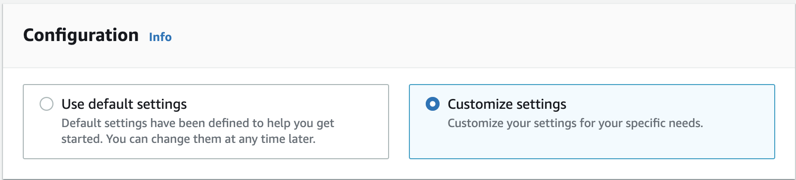
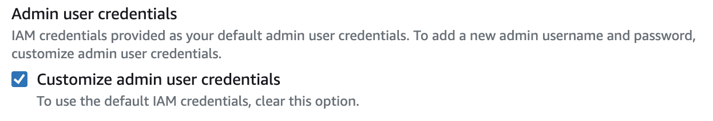
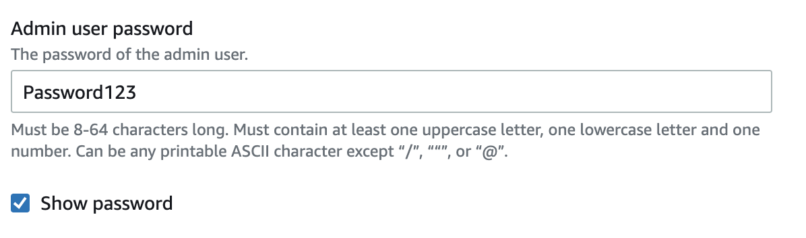
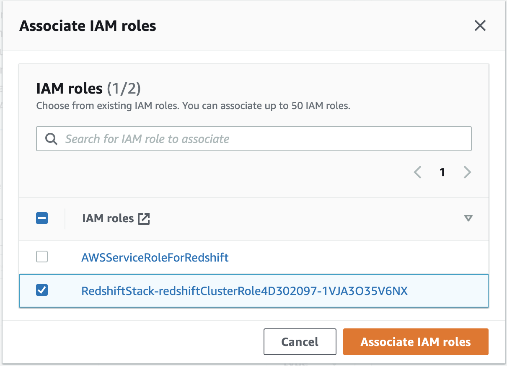
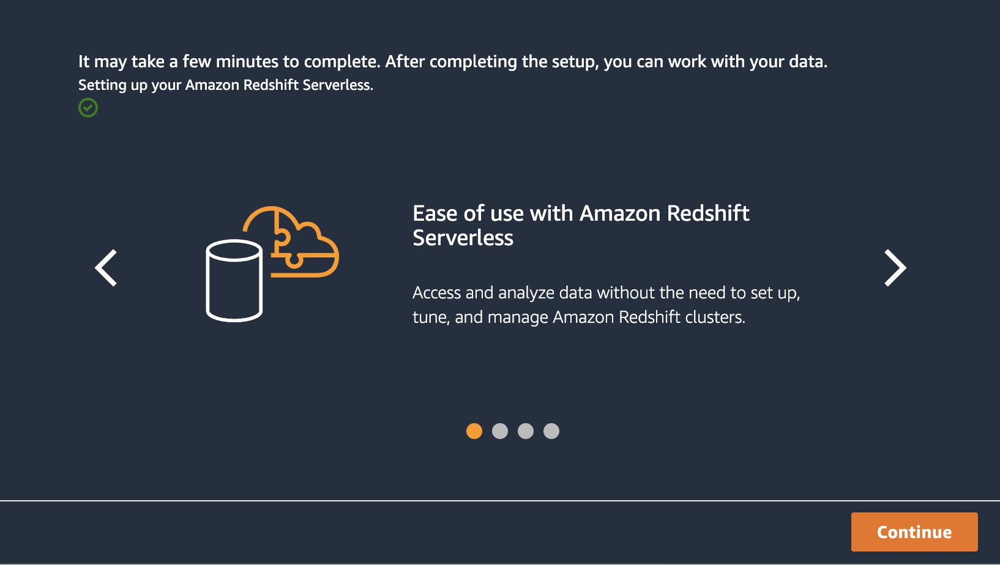
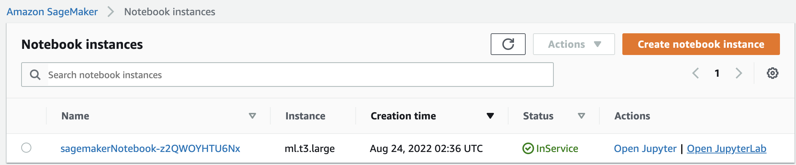

# ASEAN Roadshow Workshop


In this hands-on session, we will show how easy it is to build a serverless analytics solution using AWS. We will create a logistics dashboard using Amazon Quicksight to provide augmented intelligence and situational awareness for a logistics operations team. It connects to Amazon Redshift Serverless, a modern cloud data warehouse which unifies both near-realtime and historical data for easy analysis.


### 1 Log in to Event Engine AWS account


1.X Login to the AWS Console.

https://console.aws.amazon.com/console/home


### 2 Infrastructure provisioning using AWS Cloudshell

This section will work for any AWS region where AWS Cloudshell is available. 

2.1 Open Cloudshell

https://console.aws.amazon.com/cloudshell/home

2.2 Download install script

```bash
wget https://raw.githubusercontent.com/aws-samples/amazon-redshift-streaming-workshop/asean-roadshow/assets/scripts/install.sh
```

2.3 Run installation script

```
sh install.sh
```

2.4 Enter Redshift admin password: **Password123**

Note: Passwords must be at least 8 chars, and contain at least one uppercase letter, one lowercase letter, and one number. Take note of this password as this will be used throughout the workshop. This script will store this password in the AWS Secrets manager for integration with other services.

This will trigger the infrastructure provisioning and may take 10 to 15 minutes to complete.


### 3 Create a Redshift Serverless endpoint

3.1 Go to this link to set-up a Redshift serverless endpoint

https://console.aws.amazon.com/redshiftv2/home?#serverless-setup


3.2 Select **Customize Settings**




3.3 Click on **Customize admin user credentials**



3.4 Specify the **Admin user password**: **Password123**

This needs to be consistent with the password we specified in Step 2.4



3.5 Click on **Manage IAM roles**, then click on **Associate IAM roles**.


3.6 Select the role that has been provisioned for Redshift. It is prefixed with **RedshiftStack-redshiftClusterRole** and click **Associate IAM roles**.



3.7 Click the box next to the IAM role prefixed with **RedshiftStack-redshiftClusterRole**. Click on **Set default** and then **Make default**. At the prompt, click **Confirm**.


3.8 Leave the rest of the settings to default and Click on **Save Configuration**. It will take a few minutes to set up Amazon Redshift Serverless. Once finished click **Continue**.




### 4 Connect to Redshift through Sagemaker Notebook

4.1 Go to Sagemaker notebook console

https://console.aws.amazon.com/sagemaker/home?#/notebook-instances

4.2 There will be a notebook instance already provisioned. Click on **Open JupyterLab**.



4.3 This notebook comes preinstalled with a python notebook **redshift.ipynb**. Double click on this notebook.


4.4 Execute the initialisation cell which establishes integration between Amazon Redshift and Sagemaker notebook. Click on the cell block and press **Shift + Enter**.


4.5 Test connectivity by executing a simple query to get the current user and current timestamp from Redshift

```
%%sql
SELECT CURRENT_USER, CURRENT_TIMESTAMP
```


4.6 
