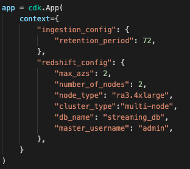

# Amazon Redshift Streaming Workshop

Most organisations today agree that data is one of their most important asset and that the ability to act on timely data, sets data-driven organisations apart from their peers. However getting access to real-time data used to require significant investment in terms of acquiring new software or in hiring specialised engineering teams. The new Amazon Redshift streaming ingestion feature aims to democratise streaming analytics with its low-cost and minimal technical skill requirements as it is primarily defined using SQL.

In this workshop, we will show how easy it is to build a streaming analytics application using this new feature. We will create a near-real time logistics dashboard using Amazon Managed Grafana to provide augmented intelligence and situational awareness for the logistics operations team. It connects to a Redshift cluster which uses Redshift streaming to analyse data from a Kinesis data stream. 


### Infrastructure Provisioning using CDK and Cloudshell

The AWS Cloud Development Kit (AWS CDK) is an open-source project that allows you to define your cloud infrastructure using familiar programming languages. In this workshop, we are using python to define the cloud infrastructure as it is one of the most commonly used programming languages used by analytics professionals.

Note: This workshop will work for any AWS region where AWS Cloudshell is available. However the workshop's instructions will be using the us-east-1 region (This can also be deployed in regions without Cloudshell but will require additional steps to provision an EC2 Linux deployment instance.) 

Note: In order for you to run this code you will need elevated privileges into the AWS account you are using.

Login to the AWS Console.

https://console.aws.amazon.com/console/home

Open Cloudshell

https://console.aws.amazon.com/cloudshell/home

Upgrade CDK to the latest version

```
sudo npm install -g aws-cdk@latest
```

Clone this git repository

```
git clone https://github.com/aws-samples/amazon-redshift-streaming-workshop --branch asean-roadshow
```

Go to the working directory:

```
cd amazon-redshift-streaming-workshop
```

Create a virtualenv:

```
python3 -m venv .venv
```

After the init process completes and the virtualenv is created, you can use the following
step to activate your virtualenv.

```
source .venv/bin/activate
```


Once the virtualenv is activated, you can install the required dependencies.

```
pip install -r requirements.txt
```

Bootstrap CDK. This will set-up the resources required by CDK to deploy into this AWS account. (This step is only required if you have not used CDK before in this account and region)

```shell
cdk bootstrap
```


Deploy all stacks and disable prompting. The entire deployment time will take 10-15 minutes.

```
cdk deploy --all --require-approval never
```

Note: There are costs associated with provisioning resources in AWS. You can change the size of the Redshift cluster by updating the contents of app.py in the project working directory.


