# Amazon Redshift Streaming Workshop

Most organisations today agree that data is one of their most important asset and that the ability to act on timely data, sets data-driven organisations apart from their peers. However getting access to real-time data used to require significant investment in terms of acquiring new software or in hiring specialised engineering teams. The new Amazon Redshift streaming ingestion feature aims to democratise streaming analytics with its low-cost and with SQL as the only skill necessary to set it up.

In this workshop, we will show how easy it is to build a streaming analytics application using this new feature. We will demo a near-real time logistics dashboard built using Amazon Managed Grafana to provide augmented intelligence and situational awareness for the logistics operations team. It connects to a Redshift cluster that uses this new streaming feature to load data from a Kinesis data stream. We will also provide instructions on how to replicate this demo in your own AWS account.

### Infrastructure Provisioning using CDK and Cloudshell

The AWS Cloud Development Kit (AWS CDK) is an open-source project that allows you to define your cloud infrastructure using your familiar programming languages. In the case of this workshop, we are using python to define the cloud infrastructure as it is one of the more commonly used languages used by analytics professionals.

Note: This workshop will work for any AWS region where AWS Cloudshell is available. However this workshop's instructions will be using us-east-1 and the links provided will work for this specific region. (This can also be deployed in regions without Cloudshell but will require additional steps to provision an EC2 Linux deployment instance.) 

Note: In order for you to run this code you will need elevated privileges into the AWS account you are using.

Login to the AWS Console.

https://us-east-1.console.aws.amazon.com/console/home

Open Cloudshell

https://us-east-1.console.aws.amazon.com/cloudshell/home?region=us-east-1

Clone this git repository

```
git clone https://github.com/aws-samples/amazon-redshift-streaming-workshop
```

Go to the working directory:

```
cd amazon-redshift-streaming-workshop
```

Create a virtualenv:

```
python3 -m venv .venv
```

After the init process completes and the virtualenv is created, you can use the following
step to activate your virtualenv.

```
source .venv/bin/activate
```


Once the virtualenv is activated, you can install the required dependencies.

```
pip install -r requirements.txt
```

Bootstrap CDK. (This step is only required if you have not used CDK before in this account and region)

```shell
cdk bootstrap
```

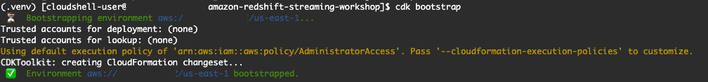

Deploy all stacks and disable prompting. The entire deployment time will take 10-15 minutes.

```
cdk deploy --all --require-approval never
```

Note: There are costs associated with provisioning resources in AWS. You can change the size of the Redshift cluster.

#### Post-deployment Redshift configuration

At the moment setting up a default IAM role could not be configured automatically using CloudFormation. The following are the steps to define a default IAM role.

Go to the Redshift console

https://us-east-1.console.aws.amazon.com/redshiftv2/home?region=us-east-1#dashboard

Select the cluster that we provisioned, redshiftstreamingcluster-xxxxxxxxx

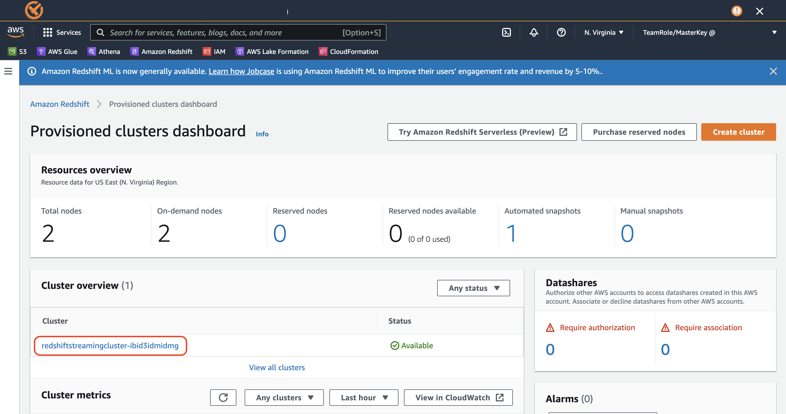


Go to the Properties tab:

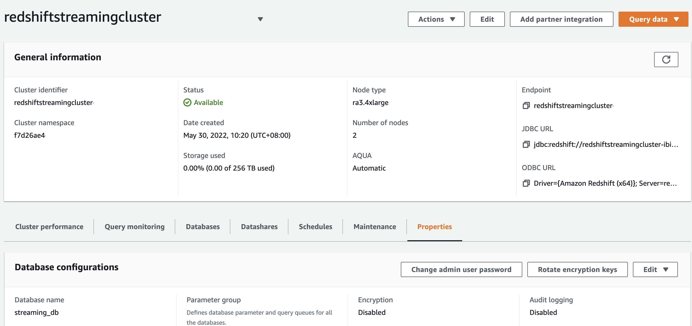


Scroll down to Cluster permissions. Select the IAM role that we provisioned and make this the default IAM role through the drop down menu.


Scroll down to Tags and click on Add tags.


Specify GrafanaDataSource as a Key and click Save changes. This tag is used by the IAM integration between Amazon Redshift and Amazon Managed Grafana.


Note: **If you get disconnected from Cloudshell** please follow the following steps. New Cloudshell sessions always start in the home directory and the python virtual environment will be deactivated.

Go to working directory

```
cd amazon-redshift-streaming-workshop
```

Activate python virtual environment

```
source .venv/bin/activate
```

Continue from where you left off.

(Optional step)

You can also check the status of deployment in Cloudformation.

https://us-east-1.console.aws.amazon.com/cloudformation/home


### Create Redshift Streaming objects (Event Engine)

Login to the Redshift Query Editor v1

https://us-east-1.console.aws.amazon.com/redshiftv2/home?region=us-east-1#query-editor:

Click on Connect to database


Specify temporary credentials to login to Redshift

​	Database name: streaming_db

​	Database user: admin

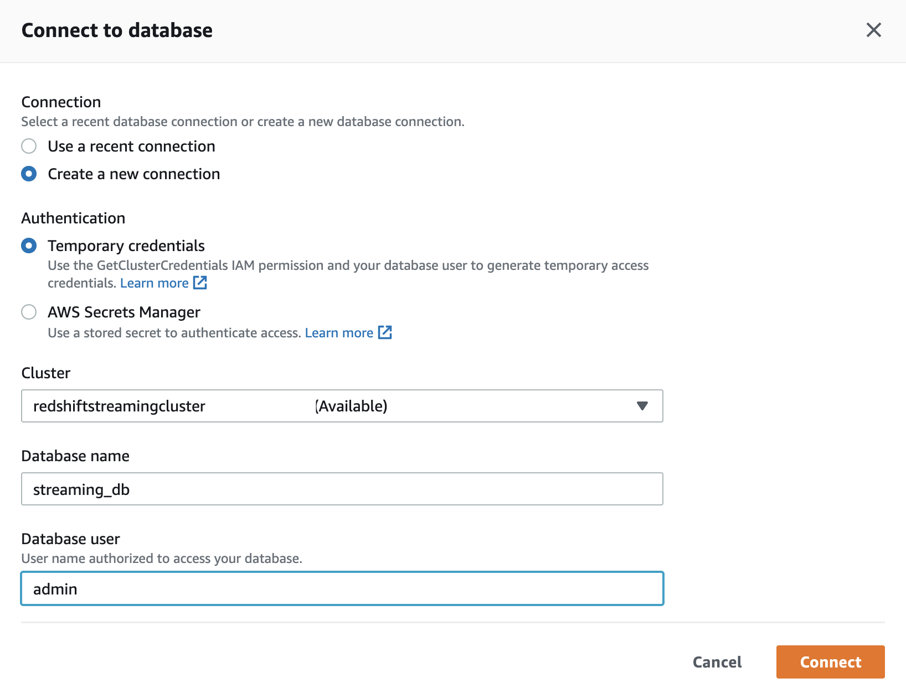

Create an external schema to establish connection between the Redshift cluster and the Kinesis data stream. 

```sql
CREATE EXTERNAL SCHEMA kinesis_schema
FROM KINESIS
IAM_ROLE default;
```


Create a materialized view to parse data in the kinesis data stream, customer_stream. In this case, the whole payload is ingested as is and stored using the super data type in Redshift.

```sql
CREATE MATERIALIZED VIEW customer_stream AS
SELECT ApproximateArrivalTimestamp,
JSON_PARSE(from_varbyte(Data, 'utf-8')) as customer_data
FROM kinesis_schema.customer_stream
WHERE is_utf8(Data) AND is_valid_json(from_varbyte(Data, 'utf-8'));
```

Note: highlight the block of SQL code that you need to run in the Query Editor.


Refresh the materialized views. This is where the actual data ingestion happens. Data gets loaded from the kinesis data stream into Amazon S3 without having to stage it first in S3.

```sql
REFRESH MATERIALIZED VIEW customer_stream;
```

We can now query the data in the customer_stream using standard select statement.

```
SELECT * FROM customer_stream;
```

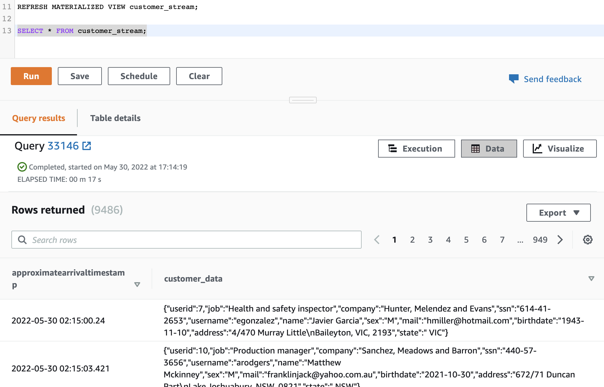

If we like to know the distribution of our customers across different states, we can easily unpack the contents of the JSON payload using the [PartiQL](https://partiql.org/) syntax.

```sql
SELECT count(1), customer_data.STATE::VARCHAR
FROM customer_stream
GROUP BY customer_data.STATE;
```


Now let us ingest data from the order_stream. Let us create a materialized view that unpacks the data within the order stream.

```sql
CREATE MATERIALIZED VIEW order_stream AS
SELECT ApproximateArrivalTimestamp,
CAST(JSON_EXTRACT_PATH_TEXT(from_varbyte(Data, 'utf-8'), 'consignmentid', true) AS BIGINT) as consignmentid,
CAST(JSON_EXTRACT_PATH_TEXT(from_varbyte(Data, 'utf-8'), 'timestamp', true) AS VARCHAR(50)) as order_timestamp,
CAST(JSON_EXTRACT_PATH_TEXT(from_varbyte(Data, 'utf-8'), 'delivery_address', true) AS VARCHAR(100)) as delivery_address,
CAST(JSON_EXTRACT_PATH_TEXT(from_varbyte(Data, 'utf-8'), 'delivery_state', true) AS VARCHAR(50)) as delivery_state,
CAST(JSON_EXTRACT_PATH_TEXT(from_varbyte(Data, 'utf-8'), 'origin_address', true) AS VARCHAR(100)) as origin_address,
CAST(JSON_EXTRACT_PATH_TEXT(from_varbyte(Data, 'utf-8'), 'origin_state', true) AS VARCHAR(50)) as origin_state,
CAST(JSON_EXTRACT_PATH_TEXT(from_varbyte(Data, 'utf-8'), 'delay_probability', true) AS VARCHAR(10)) as delay_probability,
CAST(JSON_EXTRACT_PATH_TEXT(from_varbyte(Data, 'utf-8'), 'days_to_deliver', true) AS INT) as days_to_deliver,
CAST(JSON_EXTRACT_PATH_TEXT(from_varbyte(Data, 'utf-8'), 'delivery_distance', true) AS FLOAT) as delivery_distance,
CAST(JSON_EXTRACT_PATH_TEXT(from_varbyte(Data, 'utf-8'), 'userid', true) AS INT) as userid,
CAST(JSON_EXTRACT_PATH_TEXT(from_varbyte(Data, 'utf-8'), 'revenue', true) AS FLOAT) as revenue,
CAST(JSON_EXTRACT_PATH_TEXT(from_varbyte(Data, 'utf-8'), 'cost', true) AS FLOAT) as cost
FROM kinesis_schema.order_stream
WHERE is_utf8(Data) AND is_valid_json(from_varbyte(Data, 'utf-8'));
```

Let us refresh the materialized view.

```sql
REFRESH MATERIALIZED VIEW order_stream;
```

And query the data within the view

```sql
SELECT * FROM order_stream;
```

We can query the most recent transactions that have been ingested into Redshift using this query

```sql
SELECT current_timestamp, current_timestamp-ApproximateArrivalTimestamp as time_diff, * FROM order_stream
order by ApproximateArrivalTimestamp desc limit 10;
```


We can also join the data between the two streams and do more in depth analysis on our customer and order data. For example, we like to know what is the busiest consignment route on the state level.

```sql
SELECT os.delivery_state, cs.customer_data.state::VARCHAR as origin_state, count(1)
FROM customer_stream cs
INNER JOIN order_stream os ON cs.customer_data.userid::INT = os.userid
GROUP BY os.delivery_state, cs.customer_data.state::VARCHAR
ORDER BY count(1) desc
```


FYI - No Action Required: Refreshing the Materialized views using Step Functions

As part of the CDK deployment, we also provisioned a Step Function that will regularly refresh the materialized views on a 5 second interval. You can opt to inspect this Step Function by looking at the Step Function console. 

https://console.aws.amazon.com/states/home?region=us-east-1


### Connecting to the Redshift Cluster 

Note: This section is not compatible with accounts created using AWS Event Engine. (due to Query Editor v2 restrictions)

Login to the Redshift Query Editor v2 and connect to the redshift cluster using the drop down arrow next to the cluster name.

https://us-east-1.console.aws.amazon.com/sqlworkbench/home


Specify cluster credentials. Select **Temporary credentials** as the authentication mechanism.

Database: streaming_db

User name: admin

Click **Create connection**


Create an external schema to establish connection between the Redshift cluster and the Kinesis data stream. 

```sql
CREATE EXTERNAL SCHEMA kinesis_schema
FROM KINESIS
IAM_ROLE default;
```

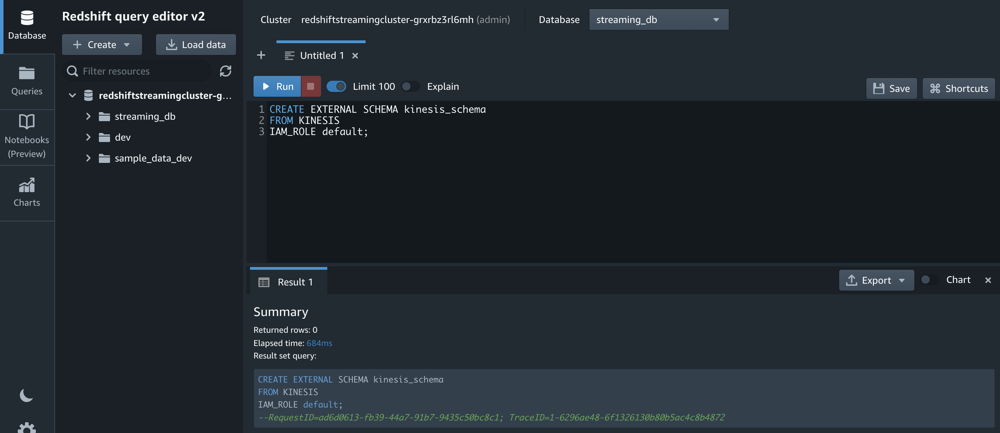

Create a materialized view to parse data in the kinesis data stream, customer_stream. In this case, the whole payload is ingested as is and stored using the super data type in Redshift.

```sql
CREATE MATERIALIZED VIEW customer_stream AS
SELECT ApproximateArrivalTimestamp,
JSON_PARSE(from_varbyte(Data, 'utf-8')) as customer_data
FROM kinesis_schema.customer_stream
WHERE is_utf8(Data) AND is_valid_json(from_varbyte(Data, 'utf-8'));
```

Note: highlight the block of SQL code that you need to run in the Query Editor.


Refresh the materialized views. This is where the actual data ingestion happens. Data gets loaded from the kinesis data stream into Amazon S3 without having to stage it first in S3.

```sql
REFRESH MATERIALIZED VIEW customer_stream;
```

We can now query the data in the customer_stream using standard select statement.

```
SELECT * FROM customer_stream;
```


If we like to know the distribution of our customers across different states, we can easily unpack the contents of the JSON payload using the [PartiQL](https://partiql.org/) syntax.

```sql
SELECT count(1), customer_data.STATE::VARCHAR
FROM customer_stream
GROUP BY customer_data.STATE;
```


Now let us ingest data from the order_stream. Let us create a materialized view that unpacks the data within the order stream.

```sql
CREATE MATERIALIZED VIEW order_stream AS
SELECT ApproximateArrivalTimestamp,
CAST(JSON_EXTRACT_PATH_TEXT(from_varbyte(Data, 'utf-8'), 'consignmentid', true) AS BIGINT) as consignmentid,
CAST(JSON_EXTRACT_PATH_TEXT(from_varbyte(Data, 'utf-8'), 'timestamp', true) AS VARCHAR(50)) as order_timestamp,
CAST(JSON_EXTRACT_PATH_TEXT(from_varbyte(Data, 'utf-8'), 'delivery_address', true) AS VARCHAR(100)) as delivery_address,
CAST(JSON_EXTRACT_PATH_TEXT(from_varbyte(Data, 'utf-8'), 'delivery_state', true) AS VARCHAR(50)) as delivery_state,
CAST(JSON_EXTRACT_PATH_TEXT(from_varbyte(Data, 'utf-8'), 'origin_address', true) AS VARCHAR(100)) as origin_address,
CAST(JSON_EXTRACT_PATH_TEXT(from_varbyte(Data, 'utf-8'), 'origin_state', true) AS VARCHAR(50)) as origin_state,
CAST(JSON_EXTRACT_PATH_TEXT(from_varbyte(Data, 'utf-8'), 'delay_probability', true) AS VARCHAR(10)) as delay_probability,
CAST(JSON_EXTRACT_PATH_TEXT(from_varbyte(Data, 'utf-8'), 'days_to_deliver', true) AS INT) as days_to_deliver,
CAST(JSON_EXTRACT_PATH_TEXT(from_varbyte(Data, 'utf-8'), 'delivery_distance', true) AS FLOAT) as delivery_distance,
CAST(JSON_EXTRACT_PATH_TEXT(from_varbyte(Data, 'utf-8'), 'userid', true) AS INT) as userid,
CAST(JSON_EXTRACT_PATH_TEXT(from_varbyte(Data, 'utf-8'), 'revenue', true) AS FLOAT) as revenue,
CAST(JSON_EXTRACT_PATH_TEXT(from_varbyte(Data, 'utf-8'), 'cost', true) AS FLOAT) as cost
FROM kinesis_schema.order_stream
WHERE is_utf8(Data) AND is_valid_json(from_varbyte(Data, 'utf-8'));
```

Let us refresh the materialized view.

```sql
REFRESH MATERIALIZED VIEW order_stream;
```

And query the data within the view

```sql
SELECT * FROM order_stream;
```

We can query the most recent transactions that have been ingested into Redshift using this query

```sql
SELECT current_timestamp, current_timestamp-ApproximateArrivalTimestamp as time_diff, * FROM order_stream
order by ApproximateArrivalTimestamp desc limit 10;
```


We can also join the data between the two streams and do more in depth analysis on our customer and order data. For example, we like to know what is the busiest consignment route on the state level.

```sql
SELECT os.delivery_state, cs.customer_data.state::VARCHAR as origin_state, count(1)
FROM customer_stream cs
INNER JOIN order_stream os ON cs.customer_data.userid::INT = os.userid
GROUP BY os.delivery_state, cs.customer_data.state::VARCHAR
ORDER BY count(1) desc
```

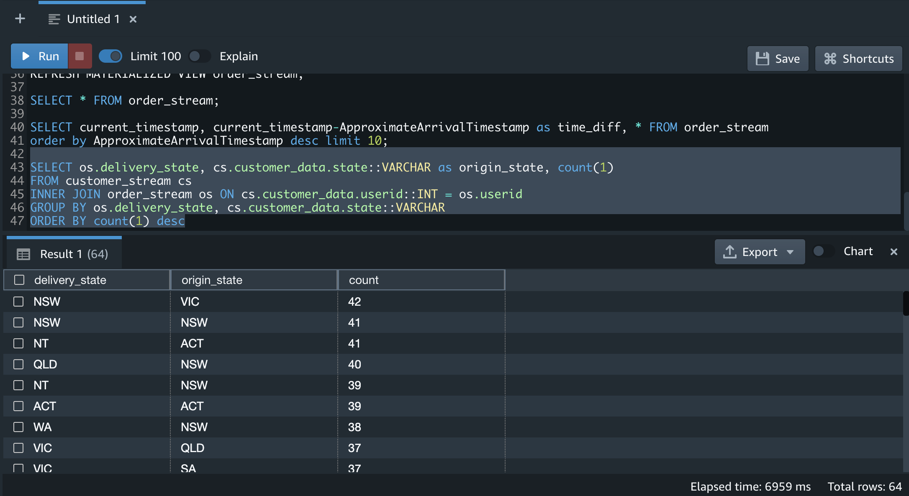


Create user redshift_data_api_user for Grafana integration. Note: We need to use this specific user, 'redshift_data_api_user' as this is used for the IAM integration between Redshift and Managed Grafana.

```sql
CREATE USER redshift_data_api_user PASSWORD '<specify your own password>';
```

We can now grant select access to this specific user.

```sql
GRANT SELECT ON ALL TABLES IN SCHEMA PUBLIC TO redshift_data_api_user;
```


FYI - No Action Required: Refreshing the Materialized views using Step Functions

As part of the CDK deployment, we also provisioned a Step Function that will regularly refresh the materialized views on a 10-20 second interval. You can opt to inspect this Step Function by looking at the Step Function console. 

https://console.aws.amazon.com/states/home?region=us-east-1


You can also check the Redshift Queries console to validate time interval between refreshes.

https://us-east-1.console.aws.amazon.com/redshiftv2/home?region=us-east-1#queries


### Creating a Grafana dashboard on Redshift streaming data 

Note: This section is not compatible with accounts created using AWS Event Engine (due to SSO restrictions)

Here is a relevant [blog](https://aws.amazon.com/blogs/mt/amazon-managed-grafana-getting-started/) that talks about how to get started with Amazon Managed Grafana. 

Go to the Amazon Managed Grafana console:

https://us-east-1.console.aws.amazon.com/grafana/home?region=us-east-1

Click on Create workspace


Specify a workspace name: redshift_streaming_workspace

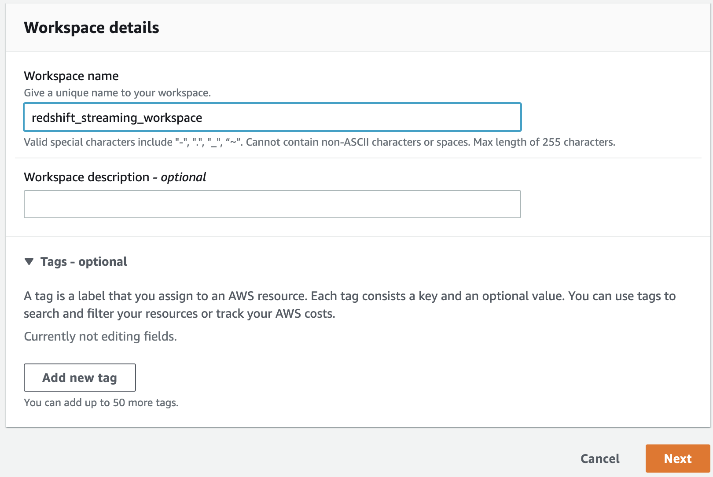

Select AWS Single Sign-On as the authentication method and click on Create user.

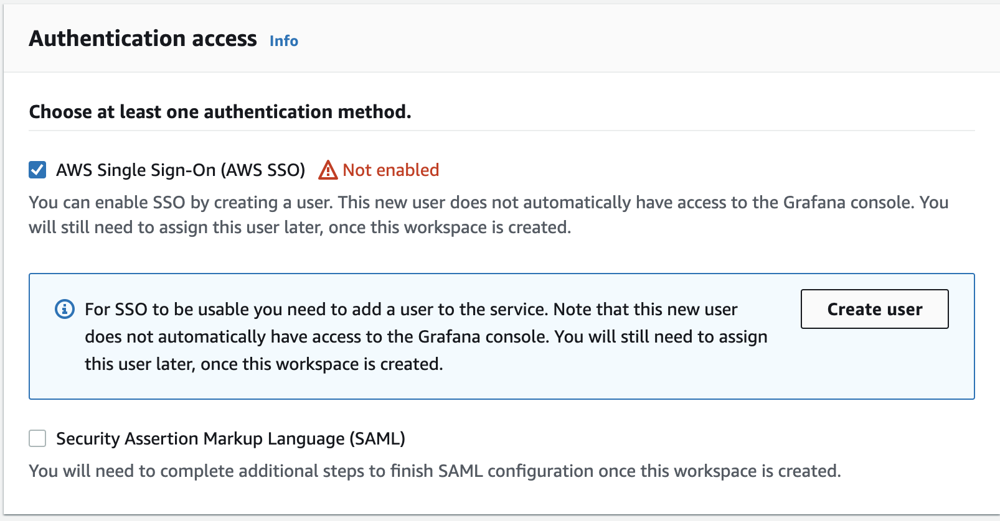

Specify user details and click Create user

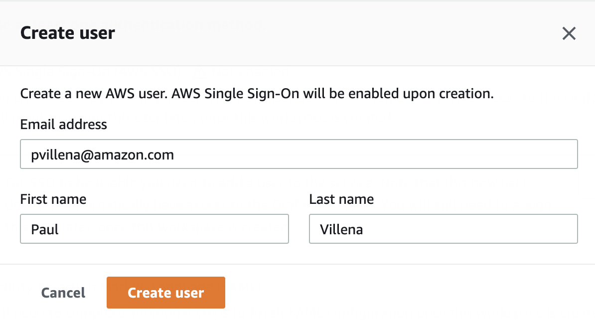

The user will receive an email to accept invitation to AWS SSO.


Accepting the invitation will prompt for the user to specify a password.

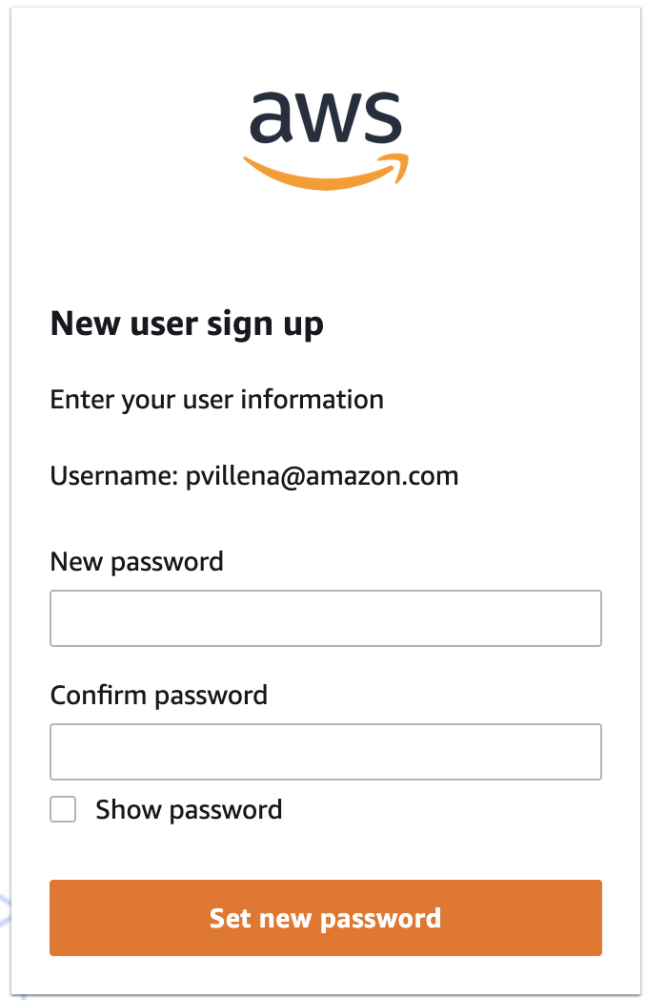


Click Next


On Service managed permission settings, select Amazon Redshift as a datasource and select Amazon SNS as a notification channel.

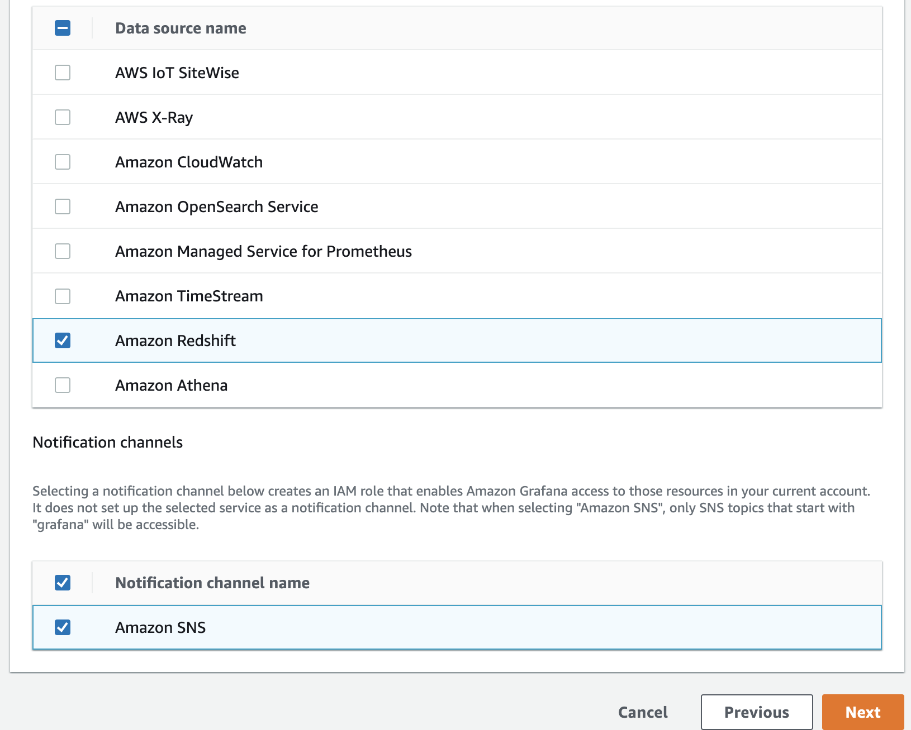

Review workspace creation settings and click on Create workspace.

Once the workspace is created, we will need to assign the SSO user to have access to the Grafana workspace. Click on Assign new user or group.


Select the user we created and click Assign users and groups.


Elevate the privileges of the user from viewer to admin and go back to the workspace screen.


Click on the Grafana workspace URL link.


Click on **Sign in with AWS SSO**

Enter username

Enter password

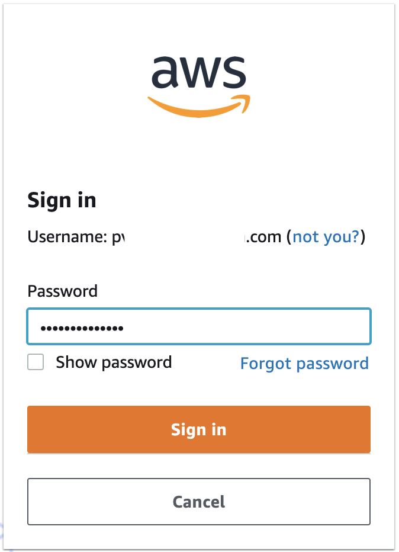

You should now be logged in to the Amazon Managed Grafana dashboard.

Click on the AWS side tab and select Data sources.


Select the Redshift service. Select US East (N. Virginia) region. Select the cluster we provisioned as part of this workshop and click on Add 1 data source.


Click on Go to settings


Rename datasource to Redshift Streaming

Set Database User to redshift_data_api_user. Click on Save & test.


Now let us import the pre-built dashboard. Click on the + side menu and click Import.

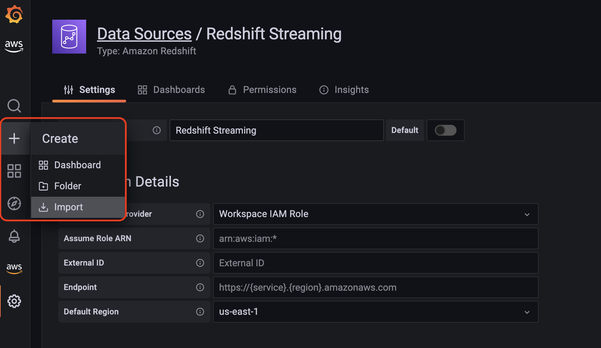

Copy and paste the contents of the dashboard.json file into the Import via panel json textbox. Click Load.

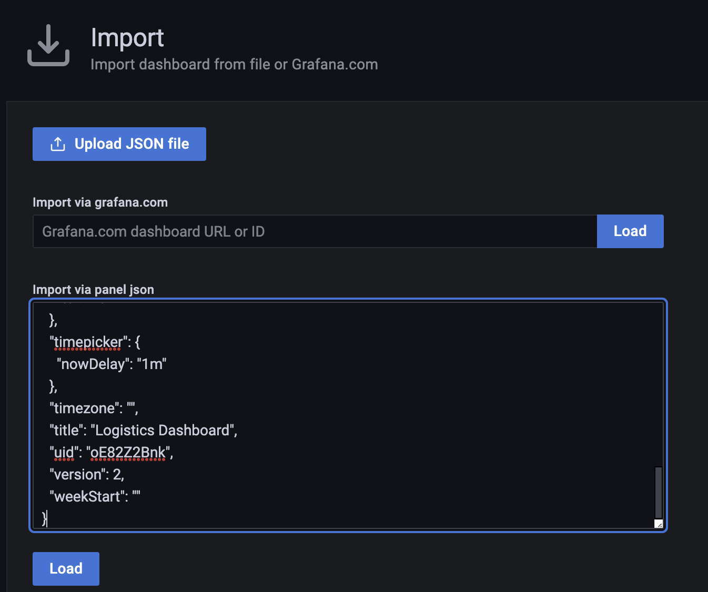

Click Import.

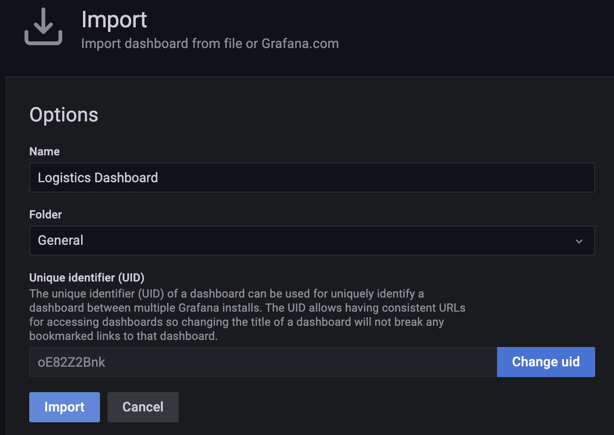

Now we have the Logistics Dashboard on Amazon Managed Grafana. This dashboard refreshes every 5 seconds and runs a query against the materialized views that we previously created in Amazon Redshift.


