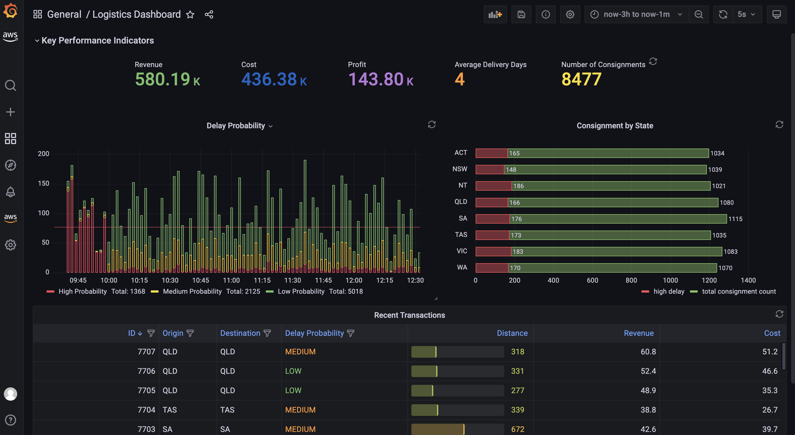
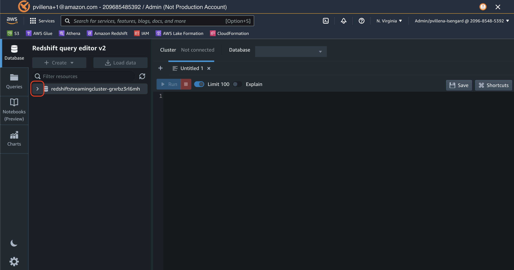
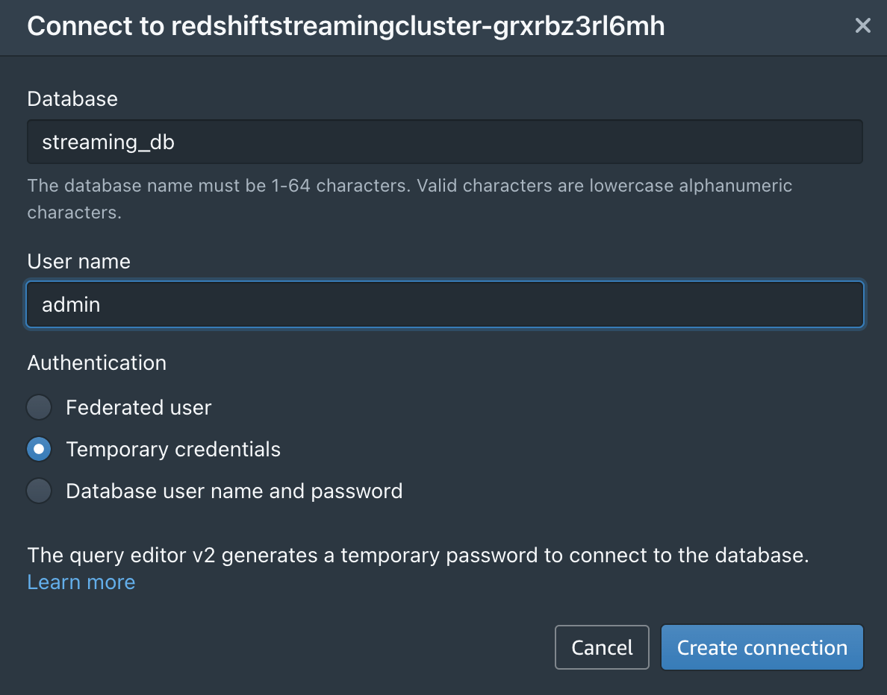
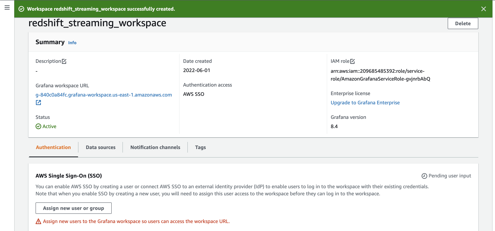
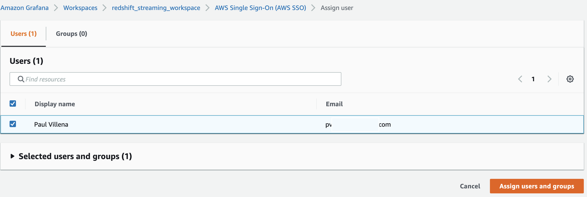
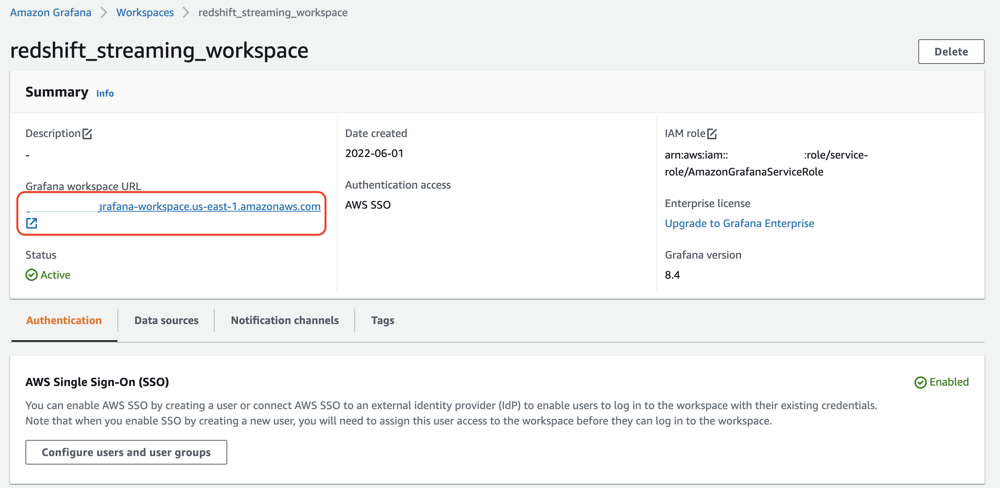
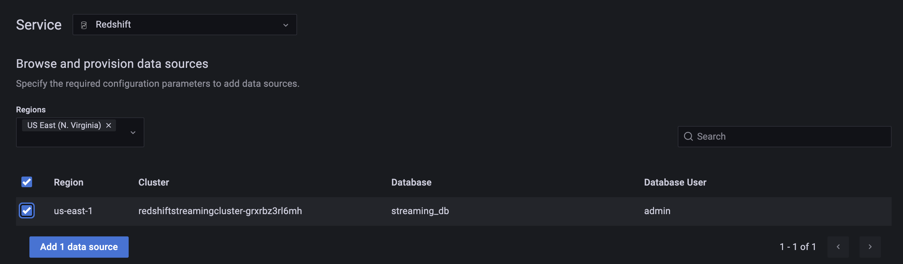
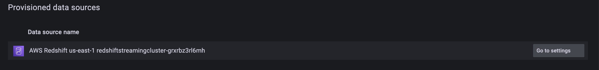
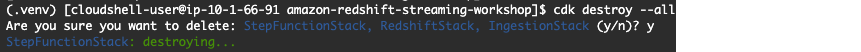

# Amazon Redshift Streaming Workshop

Most organisations today agree that data is one of their most important asset and that the ability to act on timely data, sets data-driven organisations apart from their peers. However getting access to real-time data used to require significant investment in terms of acquiring new software or in hiring specialised engineering teams. The new Amazon Redshift streaming ingestion feature aims to democratise streaming analytics with its low-cost and minimal technical skill requirements as it is primarily defined using SQL.

In this workshop, we will build a near-realtime logistics dashboard using [Amazon Redshift](https://aws.amazon.com/redshift/)  and [Amazon Managed Grafana](https://aws.amazon.com/grafana/). Our example will be an operational dashboard for a logistics company that provides situational awareness and augmented intelligence for their operations team. From this dashboard, the team can see the current state of their consignments and their logistics fleet based on events that happened only a few seconds ago. It also shows the consignment delay predictions of a Redshift ML model that helps then proactively respond to disruptions before it even happens.




**Solution Overview**

This solution is composed of the following components and the provisioning of resources will be automated using the [AWS Cloud Development Kit (AWS CDK)](https://aws.amazon.com/cdk/):

- Multiple streaming data sources are simulated through Python code running in our serverless compute service, [AWS Lambda](https://aws.amazon.com/lambda/).

- The streaming events are captured by [Amazon Kinesis Data Stream](https://aws.amazon.com/kinesis/data-streams/) which is a highly scalable serverless streaming data service. 

- We will then use the Amazon Redshift streaming feature to process and store the streaming data and Redshift ML to predict the likelihood of a consignment getting delayed.

- [AWS Step Functions](https://aws.amazon.com/step-functions) will be used for serverless workflow orchestration.

- Followed by a consumption layer built on Amazon Managed Grafana where we can visualise the insights and even generate alerts through [Amazon Simple Notification Service (SNS)](https://aws.amazon.com/sns/) for our operations team. 


### Infrastructure Provisioning using CDK and Cloudshell

The AWS Cloud Development Kit (AWS CDK) is an open-source project that allows you to define your cloud infrastructure using familiar programming languages. It leverages high level constructs to represent AWS components to simplify the build process. In this blog, we used Python to define the cloud infrastructure due to its familiarity to many data and analytics professionals.

The project has the following prerequisites:

- An [AWS account](https://console.aws.amazon.com/console/home)

- Amazon Linux 2 with [AWS CDK](https://aws.amazon.com/getting-started/guides/setup-cdk/module-two/), [Docker CLI](https://docs.aws.amazon.com/lambda/latest/dg/images-create.html) and Python3 installed. Alternatively, setting up an [AWS Cloud9 environment](https://docs.aws.amazon.com/cloud9/latest/user-guide/create-environment-main.html) will satisfy this requirement.

- Note: In order for you to run this code you will need elevated privileges into the AWS account you are using.

Clone Github repository and install python dependencies.

```bash
git clone https://github.com/aws-samples/amazon-redshift-streaming-workshop --branch blog

cd amazon-redshift-streaming-workshop
python3 -m venv .venv
source .venv/bin/activate
pip install -r requirements.txt
```

Bootstrap CDK. This will set-up the resources required by CDK to deploy into the AWS account. This step is only required if you have not used CDK in the deployment account and region

```bash
cdk bootstrap
```

Deploy all stacks. The entire deployment time will take 10-15 minutes.

```bash
cdk deploy IngestionStack
cdk deploy RedshiftStack
cdk deploy StepFunctionStack
```


### Connecting to the Redshift Cluster 

Login to the Redshift Query Editor v2 and connect to the redshift cluster using the drop down arrow next to the cluster name.

https://console.aws.amazon.com/sqlworkbench/home



Specify cluster credentials. Select **Temporary credentials** as the authentication mechanism.

Database: **dev**

User name: **rsstream_user**

Click **Create connection**



**Access streaming data using Amazon Redshift streaming ingestion feature**

The CDK deployment will provision a Redshift cluster with the appropriate default IAM role to access the Kinesis data stream. We can create an external schema to establish connection between the Redshift cluster and the Kinesis data stream. 

```sql
CREATE EXTERNAL SCHEMA ext_kinesis FROM KINESIS  
IAM_ROLE default;
```

A materialized view is used to parse data in the kinesis data stream. In this case, the whole payload is ingested as is and stored using the [SUPER](https://docs.aws.amazon.com/redshift/latest/dg/r_SUPER_type.html) data type in Redshift. Data stored in streaming engines are usually in semi-structured format and the SUPER data type provides a fast and efficient way to analyse semi-structured data within Amazon Redshift. 

```sql
CREATE MATERIALIZED VIEW consignment_stream AS
SELECT approximate_arrival_timestamp,  
JSON_PARSE(from_varbyte(kinesis_data, 'utf-8')) as consignment_data FROM ext_kinesis.consignment_stream
WHERE is_utf8(kinesis_data)
AND is_valid_json(from_varbyte(kinesis_data, 'utf-8'));
```

Refreshing the materialized view invokes Amazon Redshift to read directly from the data stream and load data into the materialized view. This refresh can be done automatically by adding the [AUTO REFRESH](https://docs.aws.amazon.com/redshift/latest/dg/materialized-view-create-sql-command.html) clause in the materialized view definition. However, in this example, we are orchestrating the end-to-end data pipeline using AWS Step Functions.

```sql
REFRESH MATERIALIZED VIEW consignment_stream;
```

Now we can start running queries against our streaming data and unify it with other datasets like the logistics fleet data. If we like to know the distribution of our consignments across different states, we can easily unpack the contents of the JSON payload using the [PartiQL](https://partiql.org/) syntax.

```sql
SELECT cs.consignment_data.origin_state::VARCHAR,
COUNT(1) number_of_consignments,
AVG(on_the_move) running_fleet,
AVG(scheduled_maintenance + unscheduled_maintenance) under_maintenance
FROM consignment_stream cs
INNER JOIN fleet_summary fs
on TRIM(cs.consignment_data.origin_state::VARCHAR) = fs.vehicle_location
GROUP BY 1
```

**Generate features using Redshift SQL functions**

The next step is to transform and enrich the streaming data using Redshift SQL to generate additional features that will be used by Redshift ML for its predictions. We will use [date and time functions](https://docs.aws.amazon.com/redshift/latest/dg/Date_functions_header.html) to identify the day of the week, and calculate the number of days between the order date and target delivery date.

We will also use [geospatial functions](https://docs.aws.amazon.com/redshift/latest/dg/geospatial-functions.html), specifically [ST_DistanceSphere](https://docs.aws.amazon.com/redshift/latest/dg/ST_DistanceSphere-function.html), to calculate the distance between origin and destination locations. The [GEOMETRY](https://docs.aws.amazon.com/redshift/latest/dg/geospatial-overview.html) data type within Redshift provides a cost-effective way to analyze geospatial data such as longitude and latitudes at scale. In this example, the addresses have already been converted to longitude and latitude. However, if you need to perform geocoding, you can [integrate Amazon Location Services with Amazon Redshift](https://aws.amazon.com/blogs/big-data/access-amazon-location-service-from-amazon-redshift/) using user-defined functions UDFs. On top of geocoding, the Amazon Location Service also allows you to more accurately [calculate route distance](https://docs.aws.amazon.com/location/latest/developerguide/calculate-route.html) between origin and destination and even specify waypoints along the way.

We are going to use another materialized view to persist these transformations. A materialized view provides a simple yet efficient way to create data pipelines using its [incremental refresh capability](https://docs.aws.amazon.com/redshift/latest/dg/materialized-view-refresh.html). Amazon Redshift identifies the incremental changes from the last refresh and only updates the target materialized view based on these changes. In this materialized view, all of our transformations are deterministic so we expect our data to be consistent when going through a full refresh or an incremental refresh.

```sql
CREATE MATERIALIZED VIEW consignment_transformed AS
SELECT
consignment_data.consignmentid::INT consignment_id,
consignment_data.consignment_date::TIMESTAMP consignment_date,
consignment_data.delivery_date::TIMESTAMP delivery_date,
consignment_data.origin_state::VARCHAR origin_state,
consignment_data.destination_state::VARCHAR destination_state,
consignment_data.revenue::FLOAT revenue,
consignment_data.cost::FLOAT cost,
DATE_PART(dayofweek, consignment_data.consignment_date::TIMESTAMP)::INT day_of_week,
DATE_PART(hour, consignment_data.consignment_date::TIMESTAMP)::INT "hour",
DATEDIFF(days,
consignment_data.consignment_date::TIMESTAMP,
consignment_data.delivery_date::TIMESTAMP
)::INT days_to_deliver,
(ST_DistanceSphere(
ST_Point(consignment_data.origin_lat::FLOAT, consignment_data.origin_long::FLOAT),
ST_Point(consignment_data.destination_lat::FLOAT, consignment_data.destination_long::FLOAT)
) / 1000 --convert to km
) delivery_distance
FROM consignment_stream;
```

**Predict delays using Redshift ML**

We can use this enriched data to make predictions on the delay probability of a consignment. [Redshift ML](https://docs.aws.amazon.com/redshift/latest/dg/getting-started-machine-learning.html) is a feature of Amazon Redshift that allows you to use the power of Amazon Redshift to build, train, and deploy machine learning (ML) models directly within your data warehouse.

The training of a new Redshift ML model has been initiated as part of the CDK deployment. This is done using the [CREATE MODEL](https://docs.aws.amazon.com/redshift/latest/dg/r_CREATE_MODEL.html) statement. The training dataset is defined in the FROM clause while TARGET defines which column, the model is trying to predict. The FUNCTION clause defines the name of the function that will be used to make predictions.

```sql
CREATE MODEL ml_delay_prediction -- already executed by CDK
FROM (SELECT \* FROM ext_s3.consignment_train)
TARGET probability
FUNCTION fnc_delay_probabilty
IAM_ROLE default
SETTINGS (
MAX_RUNTIME 1800, --seconds
S3_BUCKET '\<ingestionstack-s3bucketname\' --replace S3 bucket name
)
```

This simplified model is trained using historical observations and this training process takes around 30 minutes to complete. You can check the status of the training job by running the [SHOW MODEL](https://docs.aws.amazon.com/redshift/latest/dg/r_SHOW_MODEL.html) statement.

```sql
SHOW MODEL ml_delay_prediction;
```

Once the model is ready, we can start making predictions on new data that are streamed into Redshift. Predictions are generated using the Redshift ML function that was defined during the training process. We pass the calculated features from the transformed materialized view into this function and the prediction results will populate the delay_probability column.

This final output is persisted into the consignment_predictions table and AWS Step Functions is orchestrating the ongoing incremental data load into this target table. We use a table for the final output, instead of a materialized view, because ML predictions has randomness involved and it may give us non-deterministic results. Using a table gives us more control on how data is loaded.

```sql
CREATE TABLE consignment_predictions AS
SELECT \*, fnc_delay_probability(
day_of_week, "hour", days_to_deliver, delivery_distance) delay_probability
FROM consignment_transformed;
```

**(Optional Step) No Action Required**

Refreshing the Materialized views using Step Functions

As part of the CDK deployment, we also provisioned a Step Function that will regularly refresh the materialized views on a 10-20 second interval. You can opt to inspect this Step Function by looking at the Step Function console. 

https://console.aws.amazon.com/states/home?region=us-east-1


You can also check the Redshift Queries console to validate time interval between refreshes.

https://us-east-1.console.aws.amazon.com/redshiftv2/home?region=us-east-1#queries


### Creating a Grafana dashboard on Redshift streaming data 

Note: This section is not compatible with accounts created using AWS Event Engine (due to SSO restrictions)

Here is a relevant [blog](https://aws.amazon.com/blogs/mt/amazon-managed-grafana-getting-started/) that talks about how to get started with Amazon Managed Grafana. 

Go to the Amazon Managed Grafana console:

https://us-east-1.console.aws.amazon.com/grafana/home?region=us-east-1

Click on **Create workspace**.


Specify a workspace name: **redshift_streaming_workspace**

<img src="./images/image-20220601103241863.png" alt="image-20220601103241863" style="zoom:50%;" /

Select **AWS Single Sign-On** as the authentication method and click on **Create user**.

<img src="./images/image-20220601103404934.png" alt="image-20220601103404934" style="zoom:50%;" /

Specify user details and click **Create user**

<img src="./images/image-20220601103538765.png" alt="image-20220601103538765" style="zoom: 50%;" /

The user will receive an email to accept invitation to AWS SSO.


Accepting the invitation will prompt for the user to specify a password.

<img src="./images/image-20220601104031456.png" alt="image-20220601104031456" style="zoom: 40%;" /


Click **Next**

<img src="./images/image-20220601104211596.png" alt="image-20220601104211596" style="zoom:50%;" /


On Service managed permission settings, select **Amazon Redshift** as a datasource and select **Amazon SNS** as a notification channel.

<img src="./images/image-20220601104510191.png" alt="image-20220601104510191" style="zoom:50%;" /

Review workspace creation settings and click on **Create workspace**.

Once the workspace is created, we will need to assign the SSO user to have access to the Grafana workspace. Click on **Assign new user or group**.



Select the user we created and click **Assign users and groups**.



Elevate the privileges of the user from viewer to **admin** and go back to the workspace screen.


Click on the **Grafana workspace URL link**.




Click on **Sign in with AWS SSO**

Enter **username**

Enter **password**

<img src="./images/image-20220601110210714.png" alt="image-20220601110210714" style="zoom:40%;" /

You should now be logged in to the Amazon Managed Grafana dashboard.

Click on the **AWS** side tab and select **Data sources**.


Select the **Redshift** service. Select **US East (N. Virginia)** region. Select the cluster we provisioned as part of this workshop and click on **Add 1 data source**.



Click **Go to settings**



Rename datasource to **Redshift Streaming**

Set Database User to **redshift_data_api_user**. Click on **Save & test**.

<img src="./images/image-20220601121543957.png" alt="image-20220601121543957" style="zoom:50%;" /

Now let us import the pre-built dashboard. Click on the **+** side menu and click **Import**.

<img src="./images/image-20220601121846321.png" alt="image-20220601121846321" style="zoom:50%;" /

Copy and paste the contents of the [dashboard.json](https://raw.githubusercontent.com/aws-samples/amazon-redshift-streaming-workshop/main/dashboard.json) file into the Import via panel json textbox. Click Load.

<img src="./images/image-20220601123118745.png" alt="image-20220601123118745" style="zoom:50%;" /

Click **Import**.

<img src="./images/image-20220601123243439.png" alt="image-20220601123243439" style="zoom:50%;" /

Now we have the Logistics Dashboard on Amazon Managed Grafana. This dashboard refreshes every 5 seconds and runs a query against the materialized views that we previously created in Amazon Redshift.


### Clean up

This is to delete all resources created as part of this workshop.

Go back to AWS CloudShell

https://us-east-1.console.aws.amazon.com/cloudshell/home?region=us-east-1

Go to working directory

```
cd amazon-redshift-streaming-workshop
```

Activate python virtual environment

```
source .venv/bin/activate
```

Destroy resources

```
cdk destroy --all
```


