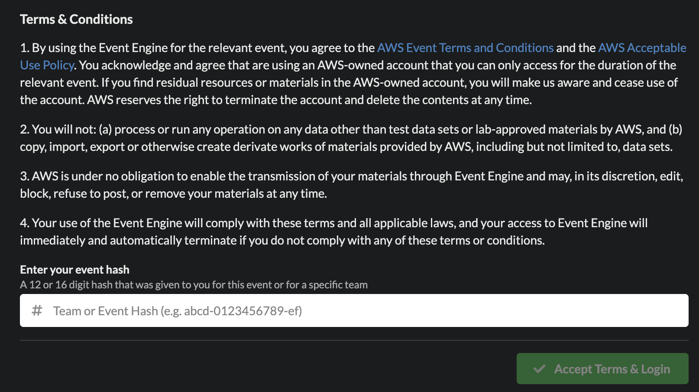
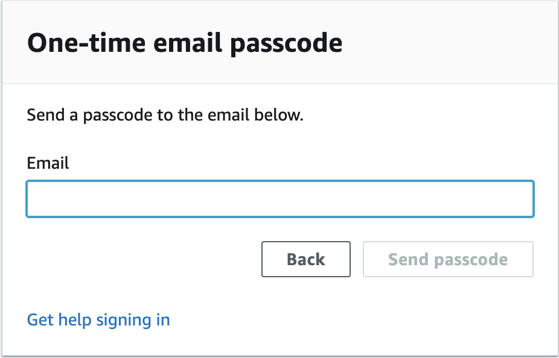
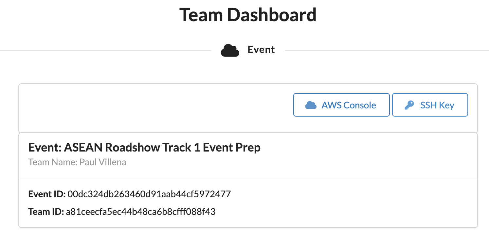
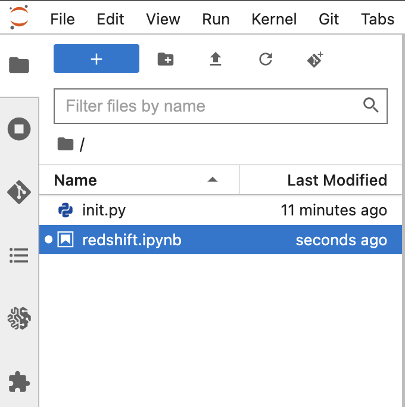
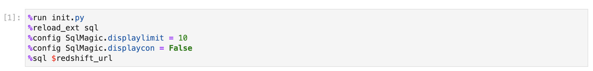
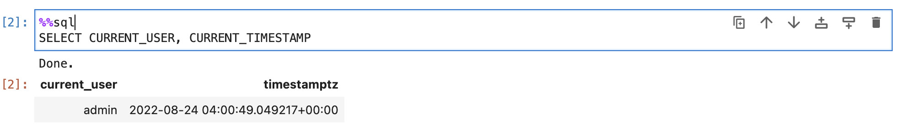

# ASEAN Roadshow Workshop


In this hands-on session, we will show how easy it is to build a serverless analytics solution using AWS. We will create a logistics dashboard using Amazon Quicksight to provide augmented intelligence and situational awareness for a logistics operations team. It connects to Amazon Redshift Serverless, a modern cloud data warehouse which unifies both near-realtime and historical data for easy analysis.


### 1 Log in to Event Engine AWS account


Running the workshop at an AWS Event

This workshop creates an AWS account. You will need the **Event Hash** provided upon entry, and your email address to track your unique session.

Connect to the portal by clicking the button or browsing to [https://dashboard.eventengine.run/](https://dashboard.eventengine.run/). The following screen shows up.



Enter the provided hash in the text box. The button on the bottom right corner changes to **Accept Terms & Login**. Click on that button to continue.

Click on **Email One-Time Password (OTP)**.

Enter **Email** (company email address) and click **Send passcode**.




It may take a few minutes to receive your passcode through your email. Enter the passcode and click **Sign in**.


This should redirect you to the Team Dashboard. Click on **Set Team Name** and specify your name to help us link the account to the user.

Click on **AWS Console**. 



Click on **Open Console**. This will open AWS Console in a new browser tab.


### 2 Infrastructure provisioning using AWS Cloudshell

This section will work for any AWS region where AWS Cloudshell is available. 

2.1 Open Cloudshell

https://console.aws.amazon.com/cloudshell/home

2.2 Download install script

```bash
wget https://raw.githubusercontent.com/aws-samples/amazon-redshift-streaming-workshop/asean-roadshow/assets/scripts/install.sh
```

2.3 Run installation script

```
sh install.sh
```

2.4 Enter Redshift admin password: **Password123**

Note: Passwords must be at least 8 chars, and contain at least one uppercase letter, one lowercase letter, and one number. Take note of this password as this will be used throughout the workshop. This script will store this password in the AWS Secrets manager for integration with other services.

This will trigger the infrastructure provisioning and may take 10 to 15 minutes to complete.


### 3 Create a Redshift Serverless endpoint

3.1 Go to this link to set-up a Redshift serverless endpoint

https://console.aws.amazon.com/redshiftv2/home?#serverless-setup


3.2 Select **Customize Settings**


3.3 Click on **Customize admin user credentials**


3.4 Specify the **Admin user password**: **Password123**

This needs to be consistent with the password we specified in Step 2.4


3.5 Click on **Manage IAM roles**, then click on **Associate IAM roles**.


3.6 Select the role that has been provisioned for Redshift. It is prefixed with **RedshiftStack-redshiftClusterRole** and click **Associate IAM roles**.


3.7 Click the box next to the IAM role prefixed with **RedshiftStack-redshiftClusterRole**. Click on **Set default** and then **Make default**. At the prompt, click **Confirm**.


3.8 Leave the rest of the settings to default and Click on **Save Configuration**. It will take a few minutes to set up Amazon Redshift Serverless. Once finished click **Continue**.


### 4 Setting up Glue Data Catalog


### 5 Connect to Redshift through Sagemaker Notebook

5.1 Go to Sagemaker notebook console

https://console.aws.amazon.com/sagemaker/home?#/notebook-instances

5.2 There will be a notebook instance already provisioned. Click on **Open JupyterLab**.


5.3 This notebook comes preinstalled with a python notebook **redshift.ipynb**. Double click on this notebook.



5.4 Execute the initialisation cell which establishes integration between Amazon Redshift and Sagemaker notebook. Click on the cell block and press **Shift + Enter**.



5.5 Test connectivity by executing a simple query to get the current user and current timestamp from Redshift

```sql
%%sql
SELECT CURRENT_USER, CURRENT_TIMESTAMP
```



5.6 Create an external schema to establish connection between the Redshift cluster and the Kinesis data stream.

```sql
%%sql
CREATE EXTERNAL SCHEMA kinesis_schema
FROM KINESIS
IAM_ROLE default;
```

5.7 Create a materialized view to ingest the streaming data into Redshift. This uses the new Redshift streaming feature. The data in kinesis data stream is in a JSON format and this can be ingested as is into Redshift using the SUPER data type

```sql
%%sql
CREATE MATERIALIZED VIEW order_stream_json AS
SELECT ApproximateArrivalTimestamp, JSON_PARSE(from_varbyte(Data, 'utf-8'))  order_json
FROM kinesis_schema.order_stream
WHERE is_utf8(Data) AND is_valid_json(from_varbyte(Data, 'utf-8'));
```

5.8 Refresh the materialized views. This is where the actual data ingestion happens. Data gets loaded from the kinesis data stream into Amazon S3 without having to stage it first in S3. This allows us to achieve faster performance and improved latency.

```sql
%%sql
REFRESH MATERIALIZED VIEW order_stream_json;
```

5.9 Now we can run a query against our streaming data

```sql
%%sql
SELECT * FROM order_stream_json LIMIT 5;
```

5.10 It is easy to unpack individual attributes in the super data type. In this example, we are extracting the delivery state and origin state attributes from the JSON data. Using this information, we can identify what is the top 5 busiest consignment routes between states.

```sql
%%sql
SELECT order_json.delivery_state::VARCHAR, order_json.origin_state::VARCHAR, count(1) 
FROM order_stream_json
GROUP BY order_json.delivery_state, order_json.origin_state
ORDER BY count(1) DESC LIMIT 5;
```

5.11 In this example, we are showing another way of declaring the materialized view using the same dataset. Here, we are unpacking the JSON data right at the start and storing it in a structured format with attributes represented as individual columns. This allows us to build reports directly on top of the streaming data.

```sql
%%sql
CREATE MATERIALIZED VIEW order_stream AS
SELECT ApproximateArrivalTimestamp, 
JSON_EXTRACT_PATH_TEXT(from_varbyte(Data, 'utf-8'), 'consignmentid', true)::BIGINT as consignmentid,
JSON_EXTRACT_PATH_TEXT(from_varbyte(Data, 'utf-8'), 'timestamp', true)::VARCHAR(50) as order_timestamp,
JSON_EXTRACT_PATH_TEXT(from_varbyte(Data, 'utf-8'), 'delivery_address', true)::VARCHAR(100) as delivery_address,
JSON_EXTRACT_PATH_TEXT(from_varbyte(Data, 'utf-8'), 'delivery_state', true)::VARCHAR(50) as delivery_state,
JSON_EXTRACT_PATH_TEXT(from_varbyte(Data, 'utf-8'), 'origin_address', true)::VARCHAR(100) as origin_address,
JSON_EXTRACT_PATH_TEXT(from_varbyte(Data, 'utf-8'), 'origin_state', true)::VARCHAR(50) as origin_state,
JSON_EXTRACT_PATH_TEXT(from_varbyte(Data, 'utf-8'), 'delay_probability', true)::VARCHAR(10) as delay_probability,
JSON_EXTRACT_PATH_TEXT(from_varbyte(Data, 'utf-8'), 'days_to_deliver', true)::INT as days_to_deliver,
JSON_EXTRACT_PATH_TEXT(from_varbyte(Data, 'utf-8'), 'delivery_distance', true)::FLOAT as delivery_distance,
JSON_EXTRACT_PATH_TEXT(from_varbyte(Data, 'utf-8'), 'userid', true)::INT as userid,
JSON_EXTRACT_PATH_TEXT(from_varbyte(Data, 'utf-8'), 'revenue', true)::FLOAT as revenue,
JSON_EXTRACT_PATH_TEXT(from_varbyte(Data, 'utf-8'), 'cost', true)::FLOAT as cost
FROM kinesis_schema.order_stream
WHERE is_utf8(Data) AND is_valid_json(from_varbyte(Data, 'utf-8'));
```

5.12 Refresh the data within the materialized view. This is where the actual data ingestion happens. Data gets loaded from the kinesis data stream into Amazon S3 without having to stage it first in S3.

```sql
%%sql
REFRESH MATERIALIZED VIEW order_stream;
```

5.13 Run a simple select query on this materialized view. Notice that each attribute are now represented as individual columns

```sql
%%sql
select * from order_stream limit 5
```

5.14 Run a count to check how many records are there in our stream.

```sql
%%sql
SELECT count(1) as total_records FROM order_stream limit 5;
```

5.15 We can query the most recent transactions that have been ingested into Redshift using this select statement. It compares the current_timestamp with the ApproximateArrivalTimestamp to measure ingestion latency.

```
%%sql
REFRESH MATERIALIZED VIEW order_stream;
SELECT current_timestamp, current_timestamp-ApproximateArrivalTimestamp as time_diff, * 
FROM order_stream
ORDER BY ApproximateArrivalTimestamp desc LIMIT 5;
```

5.15 <Add queries that join streaming data with historical data>


### 6 Quicksight
